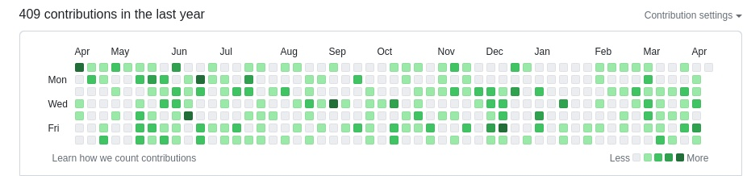

# github commit reminder (Golang version)
### [中文版](README_CN.MD)

It's a tiny tool to remind you to give at least a commint to github, just to make your personal contribution in github home page having more green block.

## Usage

1. 